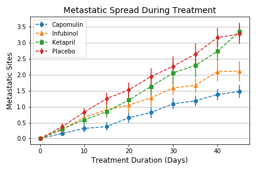
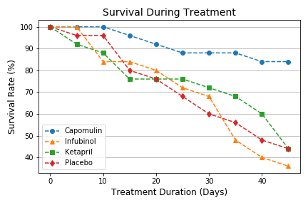

# Home Work Assignment - Matplotlib - Final Report

## Assignment Scope

* Analyzing 4 skin cancer treatment drugs (apomulin, Infubinol, Ketapril, and Placebo), based on the data from treatment responses on animals, specificaly mouse.
* Create plot to show Tumor volume changes over time, for each of the treatments. 
* Create plot to show Metastatic Sits spread over time, for each of the treatments.
* Create plot to show the survival of the mouse ove the treatment over the treatment period.
* Create a Bar chart to show the percentage change in Tumor Volume over the treatment period.
* Three observation for the above data analysis

## Synonyms
* Tumor: A tumor is a mass of tissue that's formed by an accumulation of abnormal cells.
* Cancer: A disease in which abnormal cells divide uncontrollably and destroy body tissue.
* Metastasis: In metastasis, cancer cells break away from where they first formed (primary cancer), travel through the blood or lymph system, and form new tumors (metastatic tumors) in other parts of the body.

## Complete Jupyter Notebook Code
* [Matplotlib Code](/pymaceuticals.ipynb)

### 1. Tumor Response to Treatment
* Plot on change in Tumor Volume during the treatment period, for each of the four drugs under study.
* reduction in Tumor Volume can be correlated to the effectiveness of the Drug. 

### 2. Metastatic Response to Treatment
* Plot on spread of Cancer Cells (Metastatic Sites) during the treatment period, for each of the four drugs under study. 
* reduction in spread can be correlated to the effectiveness of the Drug. 

### 3. Survival Rate During Treatment
* Plot on percentage of mouse Survived during the treatment period, for each of the four drugs under study. 
* The death of mouse can be attributed to the drug or to cancer. in general high survival rate means, less side effect of the drug. 

### 4. Summary of chaneg in Tumor Volume
* Change in Tumor Volume during the treatment period, for each of the four drugs under study. reduction in Tumor Volume can be correlated to the effectiveness of the Drug. 

## Observation
Based on the data Analysis, below are the observation / findings. 
* The drug "Capomulin" shows effectiveness in reducing the tumor growth, in the 45 day period, the mouse has shown significant reduction in the tumor volume.
* Tumor volume show little to no effect on the drugs "Infubinol, Ketapril, and Placebo".
* The drug Capomulin shows effectiveness in reducing the spread of metastasis cancer cells.  
* Capomulin also shows high survival compared to other drugs, with 84% over the course of 45 days. where as other drugs have a survival rate less than 50%.
* Also standard error for Capomulin is low on each of the graph, shows its closerness to population.  
* Considering the effectivness of Capomulin against Tumor Growth, spread of Metastatic Site, and with high survival rate in the animal study, Capomulin performs better compared to the other three drugs Infubinol, Ketapril, and Placebo.

### Thank you 

This work is part of the `Matplotlib Homework assignment` by `UOM Data Analysis and Visualization Bootcamp`.

Submited by : Ganeshkumar Gurunathan
